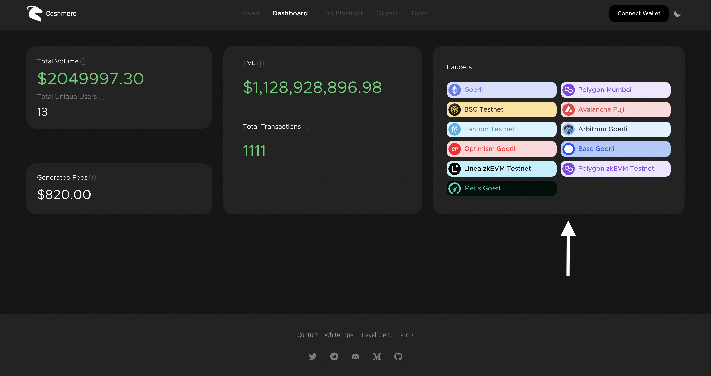

# Get Testnet Natives

In this tutorial, we will demonstrate how to utilize a testnet faucets for filling your wallet with testnet natives, allowing you to begin experimenting with CashmereLabs.

<figure><figcaption></figcaption></figure>

You can access the testnet faucets of all networks at [https://testnet.cashmere.exchange/dashboard](https://testnet.cashmere.exchange/dashboard)

Goerli ETH Faucet:\
[https://goerlifaucet.com/](https://goerlifaucet.com/)\
[https://coinbase.com/faucets/ethereum-goerli-faucet](https://coinbase.com/faucets/ethereum-goerli-faucet)\
[https://faucet.quicknode.com/ethereum/goerli](https://faucet.quicknode.com/ethereum/goerli)\
\
Polygon Mumbai Faucet:\
[https://faucet.polygon.technology/](https://faucet.polygon.technology/)\
[https://mumbaifaucet.com/](https://mumbaifaucet.com/)\
[https://www.coinbase.com/faucets/polygon-mumbai-matic-faucet](https://www.coinbase.com/faucets/polygon-mumbai-matic-faucet)\
\
BSC Testnet Faucet:\
[https://testnet.bnbchain.org/faucet-smart](https://testnet.bnbchain.org/faucet-smart)\
\
Avalanche FUJI Faucet:\
[https://faucet.avax.network/](https://faucet.avax.network/)\
\
Fantom Testnet Faucet:\
[https://faucet.fantom.network/](https://faucet.fantom.network/)\
\
Arbitrum Goerli Faucet:\
[https://faucet.quicknode.com/arbitrum/goerli](https://faucet.quicknode.com/arbitrum/goerli)\
[https://goerli.hop.exchange/#/send?token=ETH\&sourceNetwork=ethereum\&destNetwork=arbitrum](https://goerli.hop.exchange/#/send?token=ETH\&sourceNetwork=ethereum\&destNetwork=arbitrum)\
\
Optimism Goerli Faucet:\
[https://coinbase.com/faucets/optimism-goerli-faucet](https://coinbase.com/faucets/optimism-goerli-faucet)\
[https://faucet.quicknode.com/optimism](https://faucet.quicknode.com/optimism)\
[https://goerli.hop.exchange/#/send?token=ETH\&sourceNetwork=ethereum\&destNetwork=optimism](https://goerli.hop.exchange/#/send?token=ETH\&sourceNetwork=ethereum\&destNetwork=optimism)\
\
Base Goerli Faucet:\
[https://www.coinbase.com/faucets/base-ethereum-goerli-faucet](https://www.coinbase.com/faucets/base-ethereum-goerli-faucet)\
\
Linea zkEVM Faucet:\
[https://goerli.hop.exchange/#/send?token=ETH\&sourceNetwork=ethereum\&destNetwork=linea](https://goerli.hop.exchange/#/send?token=ETH\&sourceNetwork=ethereum\&destNetwork=linea)\
\
Polygon zkEVM Faucet:\
[https://faucet.quicknode.com/polygon/zkevm-goerli](https://faucet.quicknode.com/polygon/zkevm-goerli)\
[https://public.zkevm-test.net/login](https://public.zkevm-test.net/login)\
\
Metis Goerli Faucet:\
[https://goerli.faucet.metisdevops.link/](https://goerli.faucet.metisdevops.link/)
