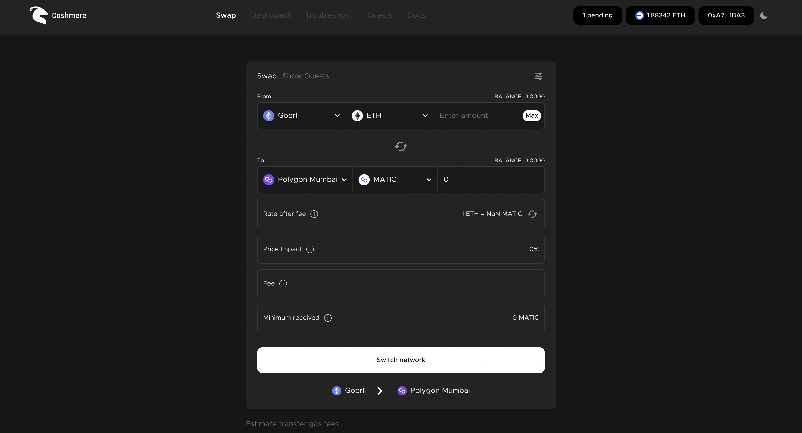
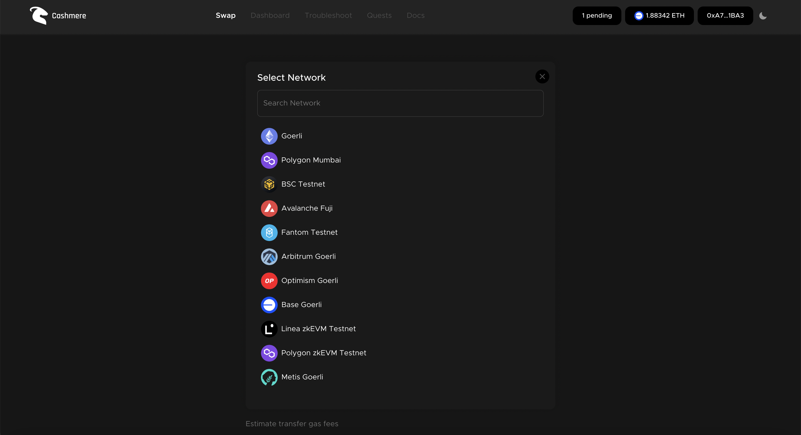
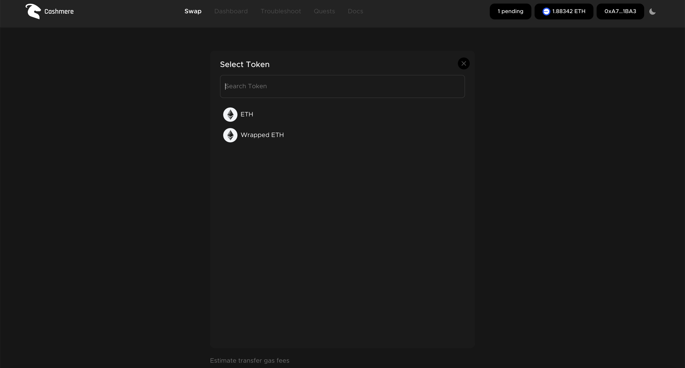
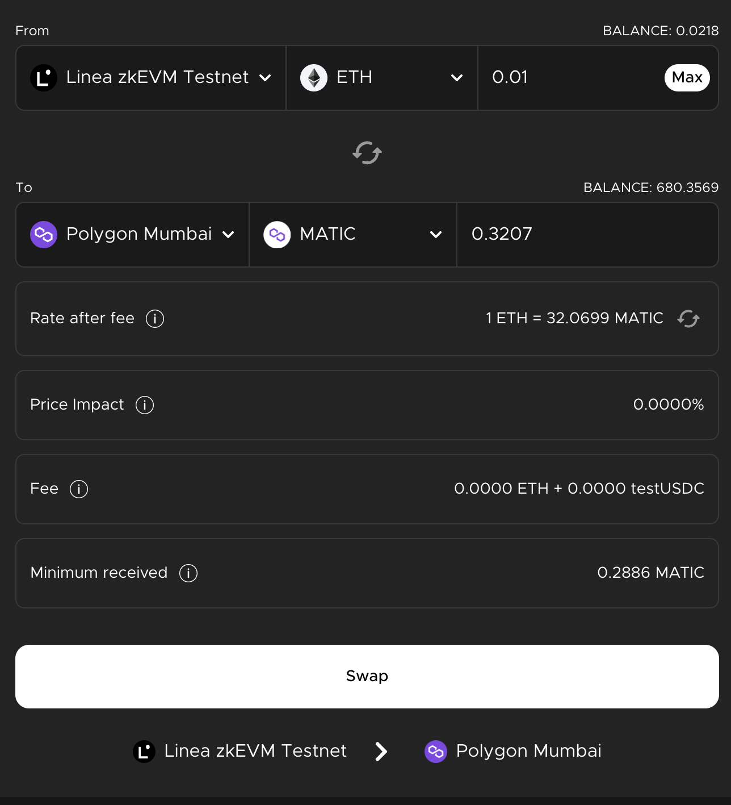
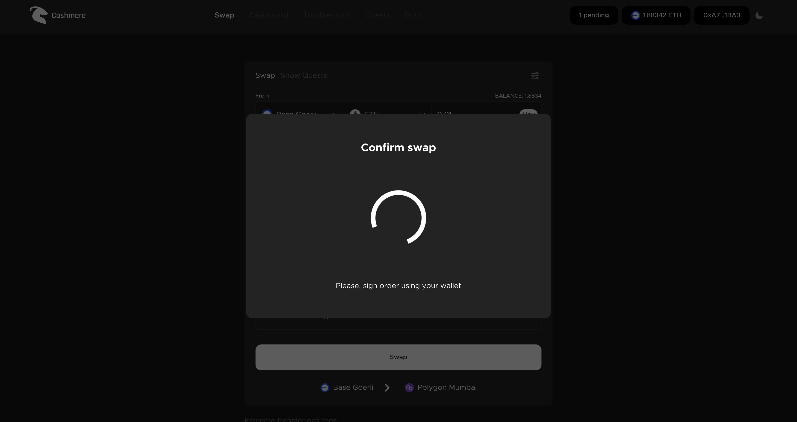
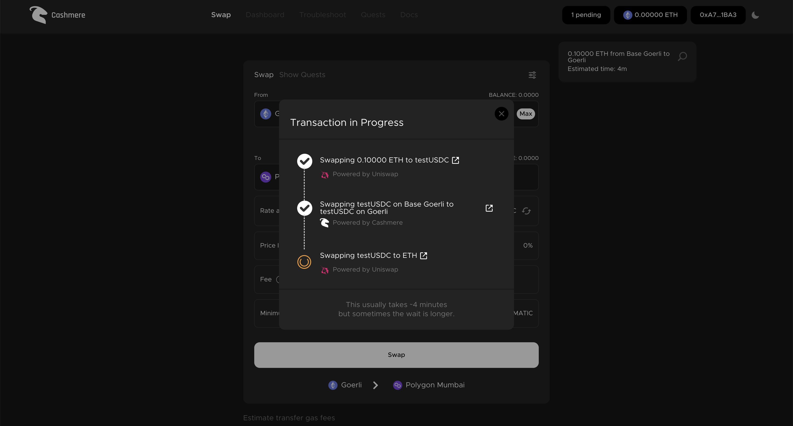
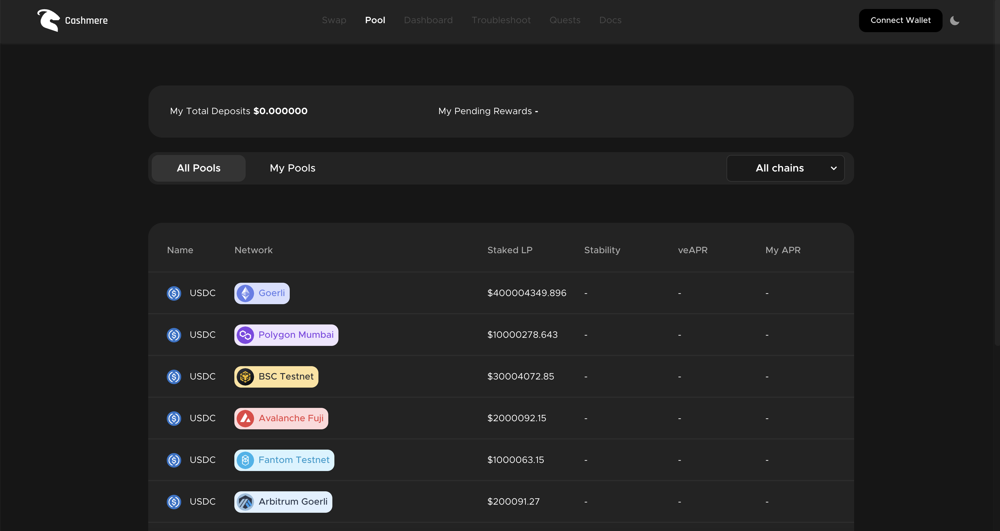
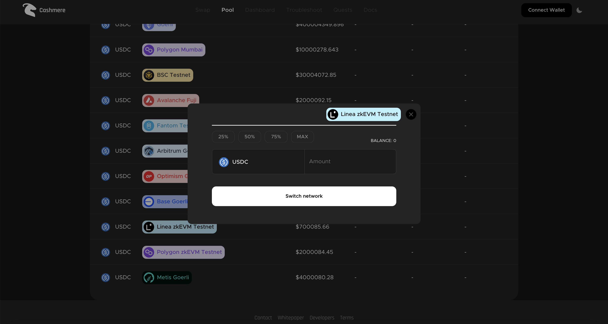

# How to Swap & Add Liquidity on Cashmere

### 1- Connect your wallet to [testnet.cashmere.exchange](how-to-swap-and-add-liquidity-on-cashmere.md#1-connect-your-wallet-to-testnet.cashmere.exchange)

<figure><figcaption></figcaption></figure>

After going to [testnet.cashmere.exchange](how-to-swap-and-add-liquidity-on-cashmere.md#1-connect-your-wallet-to-testnet.cashmere.exchange), connect your wallet to the site with the connect wallet button at the top right.

### 2- Select chains

<figure><figcaption></figcaption></figure>

Select the source and destination chain.

### 3- Select assets

<figure><figcaption></figcaption></figure>

Select source and destination chain assets and enter the amount to be swapped.

### 4- Click swap

<figure><figcaption></figcaption></figure>

After typing the amount, wait for the frontend to calculate the amount of assets you will receive on the destination chain.

### 5- Confirm swap

<figure><figcaption></figcaption></figure>

<figure><figcaption></figcaption></figure>

After calculating the amount you will receive in the opposite chain, press the 'Swap' button. Confirm the signature used for the security of users. Then confirm the transaction on your wallet and your swap process will be started. Make sure you have enough assets and gas in your wallet. We recommend using **high and aggressive gas** due to network densities. If you have an unexpected error use [troubleshooting.md](../developers/troubleshooting.md "mention")to report and get support from [support.md](../overview/support.md "mention").

### 5- Follow-up swap process

<figure><figcaption></figcaption></figure>

After your swap transaction starts, a follow-up pop-up will open and you will be able to access all transactions via scan.

### 6- Go to [faucet.cashmere.exchange](https://faucet.cashmere.exchange)

<figure><figcaption></figcaption></figure>

Go to [faucet.cashmere.exchange](https://faucet.cashmere.exchange) write your wallet to the box and request Test\_USDC.

### 6- Go to Cashmere Pools

<figure><figcaption></figcaption></figure>

Go to [https://testnet.cashmere.exchange/pool](https://testnet.cashmere.exchange/pool)

### 6- Select Linea Pool and deposit Test\_USDC

<figure><figcaption></figcaption></figure>

Select the Linea pool and deposit Test\_USDC
